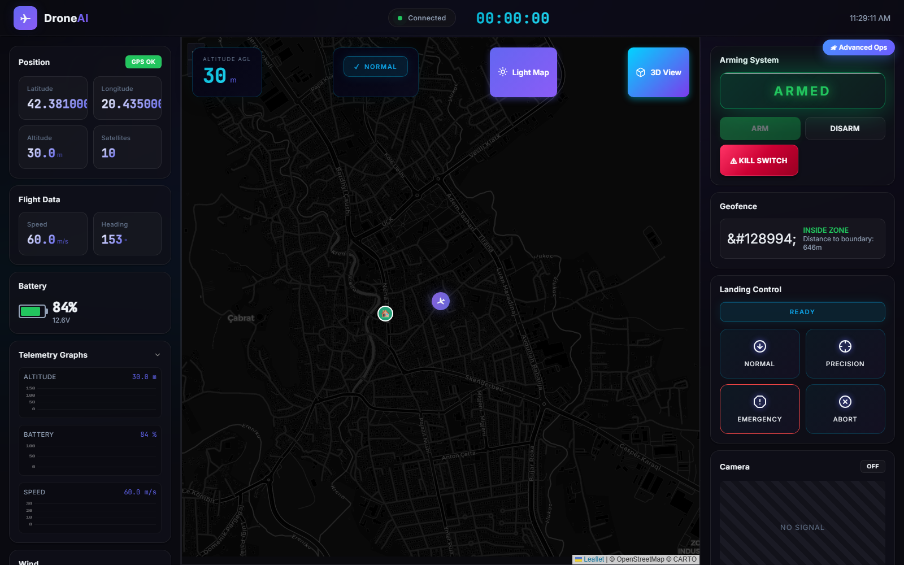
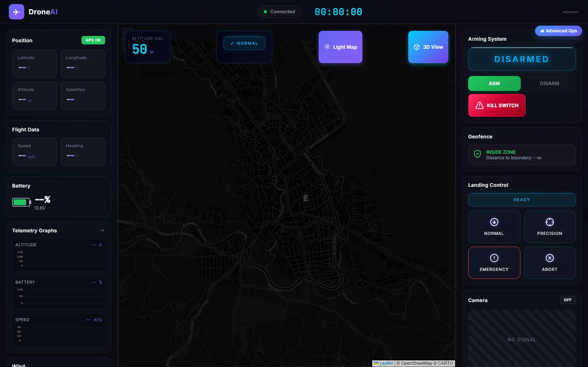
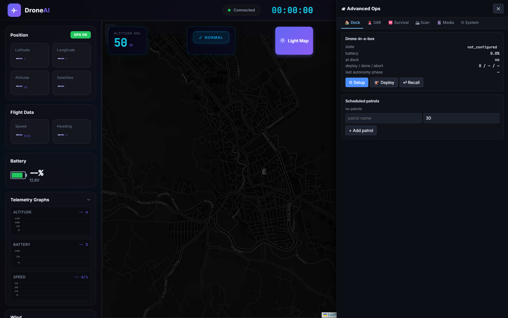

# 🛸 DroneAI

> Production-grade autonomous drone control system — flight control, computer vision, search-and-rescue, swarm coordination, drone-in-a-box, and a real-time dashboard. Pure Python, 806+ tests, runs in pure simulation or wired to ArduPilot / PX4 via MAVLink.

[]()
[]()
[]()



*The dashboard while a drone is flying an uploaded mission — real-time telemetry, map tracking, and mission control.*

---

## Quick start

```bash
# Clone
git clone https://github.com/SpaqiTechnologies/DroneAI.git
cd DroneAI

# Setup venv + deps
python -m venv venv
venv\Scripts\activate          # Windows
# source venv/bin/activate     # macOS / Linux
pip install -r requirements.txt

# Run the dashboard
python run_simulation.py
```

→ Open **http://localhost:5000** in your browser. The map opens centered on **Gjakova, Kosovo** (42.3803°N, 20.4308°E) — that's where the simulated drone spawns.

---

## How to run a simulation flight

Full step-by-step to take off, fly waypoints, and land.

### Step 1 — Start the simulation

Click **Start** in the *Simulation* card (top of the right sidebar).

You should see:

- Event log: `Simulation started (normal, 1x)`
- Purple ✈ drone icon appears on the map at Gjakova
- Green 🏠 home marker appears at the same spot
- Telemetry overlay (right edge of map) starts ticking: altitude, battery, satellites
- Wait ~2 seconds for the GPS lock — satellites should reach **10**



*Fresh dashboard, DISARMED, all telemetry fields waiting for data.*

### Step 2 — Add waypoints

Make sure the **Waypoints** tab is active in the mission planner panel (right sidebar), then **click anywhere on the map**.

You should see:

- Numbered markers (1, 2, 3…) appear at each click location
- Dashed cyan path connects them in order
- Waypoint list in the right panel fills with rows showing `lat, lon` + editable altitude
- Event log: `Waypoint N added`

Add **2–5 waypoints** for a good first flight. Each one should be at least 100m from the previous (scroll out and click around Gjakova).

> **Tip:** edit any waypoint's altitude inline by clicking its number, typing, and pressing Enter.

### Step 3 — Upload the mission

Click **Upload** (primary button under the waypoint list).

You should see:

- Event log: `Mission uploaded successfully`
- **Start** button (under Upload, in the mission panel) becomes enabled

### Step 4 — Arm the drone

Click **ARM** in the *Arming System* card (right sidebar, below Simulation).

You should see:

- Big "DISARMED" badge flips to green "ARMED"
- Event log: `Drone ARMED`

If you get a pre-arm error: check the GPS overlay shows **satellites: 10** and **3D fix**. Wait 2-3 seconds after starting the simulation before arming.

### Step 5 — Start the mission

Click the mission **Start** button (under the waypoint list — this is the *mission* Start, NOT the simulation Start).

You should see:

- Event log: `Mission started`
- Drone marker takes off (altitude climbs from 0 → waypoint altitude in the telemetry overlay)
- Purple ✈ icon flies along the dashed cyan path
- As each waypoint is reached: event log shows `Waypoint N reached`
- After the last waypoint: `Mission completed`


*Mission in progress: ARMED, position 42.381 / 20.435, altitude 30 m, speed 60 m/s, heading 153°, 84% battery.*

### Common issues

| Problem | Fix |
|---|---|
| Drone "moves a couple inches" then stops | You uploaded an empty mission. Make sure waypoints show in the right panel BEFORE clicking Upload. |
| `Pre-arm checks failed: GPS: 2 satellites` | Click Start, **wait 2-3 seconds**, then ARM. GPS sim needs time to lock. |
| Drone doesn't move after Start mission | Check `armed=True` in telemetry and `mission=running` (or watch event log for the chain). |
| Map shows old waypoints I can't remove | Click **Clear** in the mission panel, or refresh the page. |
| Start Simulation button does nothing | Simulation was probably already running. Hit **Stop** first, or hard-refresh the page (Ctrl+Shift+R). |

### Going further with the Advanced Ops drawer

Click the **🛰 Advanced Ops** pill at the top-right of the page to open a side drawer with 6 tabs for the newer features:

- **🏠 Dock** — drone-in-a-box state machine, scheduled patrols
- **🚨 SAR** — single + swarm search-and-rescue
- **🆘 Survival** — beacon trilateration, supply-drop, safe corridor
- **🏗 Scan** — adaptive 3D scan with per-bin coverage heatmap
- **🎬 Media** — highlight reel builder, LLM mission planner, inspection report
- **⚙ System** — anomaly history + inject-test button, event log

The drawer lives on top of the existing dashboard — your map / mission / telemetry stay running underneath.



*Advanced Ops drawer overlaying the dashboard, on the Dock tab (drone-in-a-box + scheduled patrols).*

Full-size versions of all screenshots live in **[docs/SCREENSHOTS.md](docs/SCREENSHOTS.md)**.

---

## What's inside

### 🛩 Flight control + safety
- Extended Kalman Filter state estimator (GPS + IMU + baro fusion)
- VIO + visual odometry + LiDAR SLAM for GPS-denied environments
- Flight modes: STABILIZE, LOITER, GUIDED, AUTO, RTL, FOLLOW, LAND
- 6-phase automated takeoff (pre-arm → spool → liftoff → climb → hover-check)
- 5 landing modes including precision-marker and safe-zone selection
- Geofencing (polygon + circular, soft warning + hard stop, altitude limits)
- Obstacle avoidance (VFH+ replanner, collision predictor, evasion strategies)
- Path planning (A*, RRT, RRT*, potential fields, smoothed trajectories)
- 9 failsafe triggers with automatic anomaly-driven escalation
- Pre-arm checks (GPS, compass, battery, props, airspace, manual confirms)

### 📡 Sensors
GPS · IMU (accel+gyro+mag+baro) · Battery · Wind · Ultrasonic · LiDAR · Optical flow · Visual odometry · Camera (single + multi-camera array: wide / tele / thermal) · Resolutions 480P → **8K** · HDR + color profiles (HLG, HDR10, DLog-M, Rec709)

### 🎬 Media
- Real on-disk **photo + video** I/O (pure-stdlib PNG encoder, optional JPEG via Pillow, manifest-driven video bundles)
- Live PNG frame stream over HTTP
- **AI highlight reel** — event-driven auto-editor that picks clip windows around detections and writes a JSON manifest

### 🧠 AI
- **YOLOv8** object detection (people, vehicles, animals, landing pads, …) with synthetic fallback when ultralytics isn't installed
- Multi-object tracking with IOU + velocity smoothing
- **Statistical anomaly detection** (11 sensor types) wired into the failsafe manager — a critical motor-vibration spike auto-triggers `MOTOR_FAILURE → land_immediately`
- **LLM command interpreter** (Ollama / Transformers / OpenAI + regex fallback) — natural language like *"survey the area here"* materializes into a real `Mission` with waypoints

### 🚨 Search-and-rescue
- 6 search patterns: expanding square, sector, parallel, creeping line, spiral, grid
- **Investigate-on-detection**: high-confidence target → descend → multi-photo close-range → resume pattern
- **Swarm SAR**: N drones split the area, cross-drone target dedupe

### 🆘 Survival / personnel-recovery
- **Beacon locator**: RSSI log-distance model + least-squares trilateration (≥3 samples) with centroid fallback
- **Supply drop**: wind-corrected release point with parachute model
- **Safe corridor**: visibility-graph + Dijkstra around threat keep-out zones

### 🏗 Mapping & inspection
- Aerial lawnmower mapper (FOV-based ground coverage)
- **Adaptive 3D scan**: coverage-aware multi-shell orbit photogrammetry, per-bin coverage matrix, automatic refinement
- Infrastructure inspector (8 asset types: tower, façade, bridge, solar panel, pipeline, …)
- **JSON + Markdown report generator** for inspections

### 🏠 Enterprise (drone-in-a-box)
- Docking station state machine (EMPTY → DOCKED → CHARGING → READY → DEPLOYED → RECALLING)
- Auto-charging with configurable profile
- **Scheduled patrols** (recurring missions with configurable period + flight duration)
- **Dock → Autonomy adapter** runs the full takeoff → patrol orbit → land cycle unattended

### 🤝 Swarm
- 9 formations (LINE, V, ECHELON, DIAMOND, GRID, CIRCLE, COLUMN, WEDGE, CUSTOM)
- Inter-drone UDP multicast + TCP messaging
- Closest-point-of-approach collision predictor with cooperative avoidance
- Leader election + state sync

### 📞 Communication
- **MAVLink** (pymavlink) — wire to ArduPilot/PX4 SITL or real autopilots
- WebSocket + Server-Sent Events live streams
- Mission upload/download

### 🛡 Safety, compliance, security
- **Remote ID broadcaster** (FAA ASD-STAN format)
- Flight recorder + maintenance tracker + predictive maintenance
- **Authenticated encryption** (encrypt-then-MAC, PBKDF2 keystream + HMAC-SHA256)
- API key + token authentication with role-based access control
- Command signer with nonce + timestamp (replay-protected)

📘 **For the full feature reference with module paths + API endpoints, see [FEATURES.md](FEATURES.md).**

---

## The dashboard

`http://localhost:5000/` serves the **Drone AI Command Center**.

**Existing tools:** Leaflet map, waypoint editor, geofence drawer, mission planner tabs, telemetry charts (altitude / battery / speed), Three.js 3D view, gimbal controls, vision-mode buttons (Normal / Thermal / Obstacle), arm/disarm/kill/RTH, failsafe triggers, swarm panel, VIO/SLAM status, Remote ID compliance card.

**🛰 Advanced Ops drawer** (top-right pill button) — six tabs:

| Tab | What's in it |
|---|---|
| 🏠 **Dock** | Drone-in-a-box state, battery, autonomy phase, setup/deploy/recall, scheduled patrols |
| 🚨 **SAR** | Single-drone + swarm search-and-rescue with live target table |
| 🆘 **Survival** | Beacon trilateration, supply drop planner, safe corridor planner |
| 🏗 **Scan** | Adaptive 3D scan with per-bin coverage heatmap |
| 🎬 **Media** | Highlight reel builder, LLM mission planner, inspection report |
| ⚙ **System** | Anomaly → failsafe history, inject-test, event log |

### Alternative: FastAPI server with OpenAPI

```bash
python run_simulation.py --fastapi
```

- `/` — minimal landing page with links
- `/dashboard` — tabbed dashboard (newer features only)
- `/docs` — auto-generated Swagger UI for all 77+ endpoints
- `/openapi.json` — OpenAPI 3 schema

---

## API quick reference

Every feature is exposed as both REST endpoints AND Socket.IO events (for live telemetry). Same JSON shapes work against either Flask or FastAPI backend.

| Group | Key endpoints |
|---|---|
| Telemetry | `GET /api/state`, `GET /api/simulation/status` |
| Live frame | `GET /api/media/latest.png` |
| Media | `POST /api/media/{snapshot,recording/start,recording/stop}`, `GET /api/media` |
| Highlight reel | `POST /api/media/highlight-reel` |
| Dock | `POST /api/dock/{setup,deploy,recall}`, `GET /api/dock/status` |
| Patrols | `POST /api/patrols/add`, `GET /api/patrols`, `DELETE /api/patrols/{id}` |
| SAR | `POST /api/sar/{plan,run}`, `GET /api/sar/{id}/report` |
| Swarm SAR | `POST /api/swarm-sar/run`, `GET /api/swarm-sar/{id}/report` |
| Survival | `POST /api/survival/beacon/{sample,reset}`, `GET /api/survival/beacon/fix`, `POST /api/survival/{supply-drop,corridor}/plan` |
| 3D scan | `POST /api/scan3d/{plan,{id}/capture}`, `GET /api/scan3d/{id}/report` |
| Inspection | `POST /api/inspection/report` |
| LLM | `POST /api/llm/mission/{plan,load}` |
| Anomalies | `GET /api/anomalies/history`, `POST /api/anomalies/inject` |
| Autonomy (FastAPI) | `POST /api/autonomy/run`, `GET /api/autonomy/{id}/status` |

---

## Running the tests

```bash
pytest tests/ -q
```

**806+ tests** covering every module. All are pure-Python and use
synthetic fallbacks for optional deps — the suite runs offline.

```bash
# Run just one suite
pytest tests/test_sar_mission.py -v

# Run the smoke scripts
python scripts/smoke_media.py
python scripts/smoke_sar_investigate.py
python scripts/smoke_patrol_loop.py
python scripts/smoke_survival.py
```

---

## Talking to a real autopilot (MAVLink)

The repo ships a full **MAVLink backend** built on `pymavlink`. Connect to an ArduPilot SITL or a real autopilot:

```python
from core.drone import Drone

drone = Drone()
drone.connect_mavlink("udpout:127.0.0.1:14550")
# Now all flight commands and telemetry flow through MAVLink
```

Mission upload/download, ack-waited COMMAND_LONG, heartbeat monitoring, and goto position are all wired.

---

## Project layout

```
ai/               YOLO detection, anomaly detection, terrain classifier, LLM
applications/     SAR, swarm SAR, survival, mapping, inspection, media
compliance/       Remote ID, flight recorder, maintenance tracker
core/             Drone, flight controller, modes, failsafes, missions,
                  docking, autonomy runtime, path planning, geofence
maintenance/      Predictive maintenance
scripts/          Smoke scripts for end-to-end demos
security/         Auth, encryption, command signing, middleware
sensors/          GPS, IMU, battery, wind, camera, lidar, optical flow,
                  visual odometry, multi-camera array, media I/O
simulation/       Flask + FastAPI servers, dashboard, static JS modules
swarm/            Coordinator, registry, comms, formation, collision
tests/            806+ tests across all of the above
```

---

## Scope & safety

DroneAI is built for **defensive and search-and-rescue** scenarios:
inspection, survey, mapping, infrastructure monitoring, security patrols,
personnel recovery (downed-soldier locate, supply drop, safe-corridor
mapping).

**Explicitly out of scope:** weapons, targeting, strike, anti-personnel
features. Threat zones in the corridor planner are treated as keep-outs
to *avoid*, not engage.

---

## Documentation

- [FEATURES.md](FEATURES.md) — complete feature reference with module paths and API endpoints
- [IMPLEMENTATION_PLAN.md](IMPLEMENTATION_PLAN.md) — phased build plan with completion status
- [docs/](docs/) — codebase analysis and competitive analysis notes
- `/docs` (when run with `--fastapi`) — auto-generated Swagger UI

---

## Contributing

Open an issue or PR at https://github.com/SpaqiTechnologies/DroneAI.

All PRs should keep the test suite green:

```bash
pytest tests/ -q
```

---

## License

MIT — see [LICENSE](LICENSE) (add one if it doesn't exist yet).

---

*Built with Python 3.13, Flask, FastAPI, pymavlink, and a lot of state machines.*
